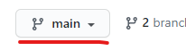
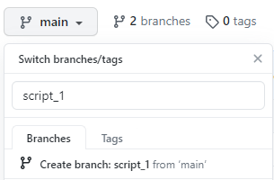
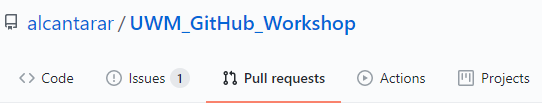
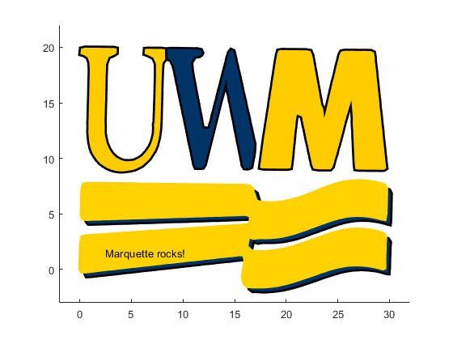

# Part 1: Making Changes with Version Control

## Background
You and your group are working together to re-create the UWM logo entirely with code for a state-wide data visualization
conference! Your group submitted your figure and just received the reviewer comments. 
Thanks to version control tools like Git and GitHub, your group will be able to quickly address these comments in parallel.

The code used to generate your figure is comprised of an upper-level script (e.g. `UWM_GitHub_Workshop/main_script`), 
which calls five numbered subscripts (e.g. `UWM_GitHub_Workshop/MATLAB_scripts/script_1`). The data required to 
generate your figure is stored as CSV files at `UWM_GitHub_Workshop/data/`. 

**If you need help remembering the git functions, refer to [`git_cheatsheet.md`](./git_cheatsheet.md).**

## Objective
Work together to address the reviewer comment for each subscript and eventually generate the revised figure 
by running `main_script`.

## 1. Organize
Your project leader has already invited you as collaborators on the remote repository on GitHub. If this hasn't 
happened yet, ask for help from the Workshop Team. It may be helpful to have one group member share their screen while 
everyone is working through this tutorial. 

### a. Assign Tasks
You will divide and conquer the reviewer comments. There is one comment for each of the five subscripts. Open a tab,
navigate to your group's repository page on GitHub, and select the [`reviewer_comments.md`](./reviewer_comments.md) 
file. After reading, assign each group member a subscript to fix. If there are more subscripts than group members, 
assign multiple subscripts for some members. 

### b. Branch Out
Once subscripts are assigned, each group member should make his or her own branch of the repository on GitHub. Branching
creates isolated versions of the current state of the repository and allows group members to simultaneously make changes 
without affecting one another or the script stored in the remote (online) repository. **Name each branch after the 
respective subscript(s) that will be fixed.**

1. Navigate to the main page of your group's repository on GitHub (e.g. www.github.com/GROUP-LEADER-USERNAME/UWM_GitHub_Workshop)
2. Click the branch selector menu:    
    
3. Type in a descriptive name for your branch (like the name of subscript you're changing), then select **Create branch**:    
    
    
    If you can't find the "create branch" button, you might not have accepted the invitation to collaborate on the 
    repository. Check your email or ask for help from the Workshop Team.
    
### c. Clone repository
If you're going to be changing code, you need a copy of it on your computer. This is initially done through a process
called *cloning*, where you download a local copy of a remote repository. To do this, you will use Git Bash or Terminal,
depending on your operating system. *This tutorial will refer to Git Bash (**not Git CMD**), but the functions are the same in Terminal.*
 
Repositories can be cloned into any folder, but for this tutorial you will be cloning into the `Desktop` folder.
Open Git Bash and navigate to the `Desktop` folder by using the `cd` (change directory) command:
```
$ cd Desktop
```
*If you're having trouble navigating into your Desktop folder, it may be possible that your desktop folder is located
 on a different hard drive (like OneNote). Windows users can open file explorer, right click on the folder they'd like
 to clone the repo into, and select `Git Bash Here`. This effectively sets the current directory in Git Bash. You can 
 also ask for help from the Workshop Team as this process can vary depending on operating system, spaces in folder names, 
 and version of Git Bash.*

Now you can clone the remote repository from GitHub.com to your `Desktop` folder. `URL` is the repository of
the group leader and will include his or her username. It should be like `https://github.com/GROUP-LEADER-USERNAME/UWM_GitHub_Workshop`.
```
$ git clone URL
```
You now have a copy of the repository located at `~/Desktop`. Go check it out! You'll see all the files that are present 
on the main page (main branch) of your group's repository on GitHub. In Git Bash, navigate into the repository you just cloned:
```
$ cd UWM_GitHub_Workshop
```
Before making any changes to files, you need to *checkout* the branch you created on GitHub. Remember that branches 
are isolated versions of a (local and/or remote) repository. You can view the available branches by executing:
```
$ git branch -a
```
You should see the `main` branch as well as any branches your group has made, although they may say `remotes/origin/` 
before your `BRANCH-NAME`. Don't worry, this just indicates that the branch is from your remote repository on GitHub.

Execute the following to switch to the branch you made (don't include `remotes/origin/`):
```
$ git checkout YOUR-BRANCH-NAME
```
Git should return a message explaining that you `"Switched to branch YOUR-BRANCH-NAME"`. 
Now you're ready to address some very reasonable reviewer comments!

### Generate Original Figure
Open and run `UWM_GitHub_Workshop/main_script`. This is the figure you submitted to the conference and will be revising 
per reviewer comments.

## 2. Making changes to files
### a. Changing your assigned subscript 
Open MATLAB (or preferred IDE for R and Python scripts) and make the requested change in 
[`reviewer_comments.md`](./reviewer_comments.md). Save the debugged file with the same filename.

### b. Commit changes
You made changes to a file in the repository and want these changes to be recorded by Git. Git takes "snapshots" called 
*commits* of your repository files. You need to communicate the following things explicitly to Git:
1) Which files to include in the commit ("snapshot").
2) When to make the commit. This process is not automatic.
3) Write a message summarizing the changes made (so you can reference them later).
3) Update the remote repository on GitHub with your local changes.

These steps are performed in Git Bash and are outlined below.

#### 1. Tell Git that files have been changed and should be included in the commit. 
Git will compare the current state of the files to their previous state and identify any changes made. Files that have
been changed will be *staged*. In the "snapshot" analogy, this step is like wrangling your family members right before 
taking the picture. Don't forget the "`.`" in the command below. This informs Git that you want to stage all the changed 
files in the repository. If many files are being changed, commits can become complex and difficult to differentiate. If 
you want to stage only specific files, replace "`.`" with the filenames separated by a space, breaking a single complex 
commit into several smaller ones.
```
$ git add .
```
Use the `status` function to view the files Git has identified as undergoing some change (lines starting with `#>>>` 
represent an example returned message):
```
$ git status

1>>> On branch BRANCH-NAME 
2>>> Your branch is up to date with 'origin/BRANCH-NAME'.
3>>>
4>>> Changes to be commited:
5>>>   (use "git restore HEAD <file>..." to unstage)
6>>>       modified: script_1.m
```
This returned message tells you a few things:
1. The branch you're working on (line 1).
2. Git found changes that are staged (the result of `git add .`; line 4).
3. How to remove a specific file from being staged (`git restore HEAD FILENAME`; line 5).
4. Names of the changed file(s) (line 6). 

#### 2 & 3. Tell Git when to make the commit and what changed
To continue using the "snapshot" analogy, you need to decide when to take the "snapshot". In this case, you changed some 
code and this represents a meaningful level of changes made to your script. To help organize commits, you need to add a  
message that will be associated with the staged changes. For now, make it short and sweet. For more information on 
meaningful commit messages, read [this blog post](https://chris.beams.io/posts/git-commit/) later. Remember: Git will 
only commit the *staged* changes. Commit changes by using the `commit` command with the `-m` (message) tag: 
```
$ git commit -m "COMMIT MESSAGE GOES HERE IN QUOTATIONS"
```
#### 3. Update remote repository
Git has now taken a snapshot of your local repository and identified all changes made. However, the remote repository 
stored on GitHub hasn't been updated. This is actually a cool feature of Git because you can make many changes (commits) 
without internet access to GitHub because you have a local copy of the repository on your computer! Then, when it's 
convenient, you can send all your commits to the repository on GitHub. This process is called *pushing* commits from a 
local repository to the remote repository.

To push commits to your remote repository on GitHub, run:
```
$ git push 
```
*The first time you push to a repository, Git Bash or Terminal may request that you login to your github account at this
time. Enter your username and password and press Enter.* 

Now your branch on the remote repository is updated with these changes! Later, we will use GitHub to view the 
line-by-line changes made to the script as well as your commit message.

**Before moving on, make sure all group members have fixed their assigned scripts, and staged/committed/pushed their changes.**

## 3. Merging branches
At this point, each branch contains their respective fixed subscripts. However, `main_script` on the `main` branch 
on GitHub still isn't updated because you haven't merged all these changes together. The way this is accomplished in 
GitHub is through a process called a *Pull Request*. Pull requests merge two branches, applying any changes made in 
one branch to the other branch. 

### a. Open Pull Request
Each member will need to open a pull request for their branch. Navigate to the main repository page on GitHub and select
the **Pull requests** tab:    

    

and then select the green "New pull request" button.

If you click on the *base repository*, you'll see multiple options because the original `UWM_GitHub_Workshop` repository is owned
by `alcantarar` and has just been copied to your group leader's account via a process called [*forking*](https://docs.github.com/en/github/getting-started-with-github/fork-a-repo).
Forking a public repository allows you to have a copy, make any changes, and potentially contribute to the original repository
via pull requests. However, in this tutorial you are just contributing to your group leader's forked `UWM_GitHub_Workshop` repository,
not the original one. Set the *base repository* to `GROUP-LEADER-USERNAME/UWM_GitHub_Workshop`, *base branch* to `main`, and the 
*compare branch* to your branch from the dropdown menu:    


GitHub will bring up information about your branch like the number of commits, files changed, and contributors. You will
also see the line-by-line changes and commit message from earlier. Select the green "Create pull request" button. Then 
GitHub will ask you to add more information about the branch you're trying to merge. Write an informative title and 
select the green "Create pull request" button to confirm your decision:  
  
    

Now, GitHub will compare the changed files in your branch to their original state in the main branch and try to implement
these changes. In some cases, there may be conflicts where multiple contributors have changed the same line of code. These
conflicts are typically resolved manually, but good project organization can generally avoid merge conflicts. **If GitHub 
finds conflicts with your pull request, ask for help from the Workshop Team before merging the pull request.**

If there are no conflicts (there shouldn't be any), select the green "Merge pull request" button and confirm your choice.
This will update the main branch to include the changes you made in your branch. **This process will need to be 
accomplished for each branch.**    

    

You can now delete the branch by selecting "Delete branch" because your script has been updated! Making branches is easy 
in Git, so it's best practice to make one for each feature you'd like to add to a script and delete it when you're done.
     


At this point, the changes have been merged in the `main` branch in the remote repository on GitHub, but not your local 
copy. Updating your local repository is easy. This process is called *pulling*.

## 4. Pull changes from Remote Repository
In Git Bash, switch back to the `main` branch:
```
$ git checkout main
```
Then, tell Git to check the remote repository for any changes that might have occurred and pull those changes over to your
local copy:
```
$ git pull
```
Now your local copy is up to date with the remote repository on GitHub. 

## Moment of Truth
Go ahead and run `main_script` on your own. If all the changes from each branch were merged into
`main`, then `main_script` should produce the reviewer's version of your figure:

<div align="center">

<p>Wait a second...</p>
</div>

# Part 2: Undoing Changes with Version Control

It appears that Reviewer 2 may be a Marquette graduate. After a conversation with conference organizers,
you decide to ignore that reviewer's comments and submit the original figure. In this particular example you would likely 
still have a copy of the original figure to just re-submit, but this tutorial will show you how to undo specifc changes with
version control. This illustrates how you could also undo changes have been made to multiple files over a long period of time. 
For a real-world example, consider how the code for your research is dynamic and changes over time. Version control allows 
you to access the history of your code, which can help with debugging or adjusting parts of the analysis in the future.

## Undoing changes
It should be noted that there are **many** ways to undo changes with Git and GitHub. The following resources can help
with different levels of undoing changes, ranging from typos in commit messages to reverting whole repositories back:
* [How to undo (almost) anything with git](https://github.blog/2015-06-08-how-to-undo-almost-anything-with-git/)
* [Undoing commits & changes](https://www.atlassian.com/git/tutorials/undoing-changes)
* [Oh shit, Git!?!](https://www.ohshitgit.com)

For the current example, one of the reviewers suggested some changes that need to be undone. Since all changes were
made in separate branches and merged into the `main` branch via pull requests, undoing these changes can be done by 
reverting each pull request on GitHub.

## Reverting a recent pull request
1. Click on the "Pull requests" tab in your group's repository page on GitHub. GitHub automatically filters pull requests 
to only show open (incomplete) ones. Click on "Closed" to view completed Pull Requests:

    

    You should see all of the pull requests completed during the tutorial. Descriptive branch names allow you to quickly 
    identify what changes were made:

    

2. Select the Pull Request that you created to complete the reviewer's edits and click "Revert":

    

    **What is going on here?** You are effectively creating a new pull request that does the exact opposite of your past 
    pull request. This is different than just deleting the old pull request because the history of your repository is 
    maintained. If, for whatever reason, you wanted to go back and see what changes you made because of the reviewer, 
    you could. There may be instances where you want to completely erase a commit or pull request, but doing so is beyond 
    the scope of this tutorial. 

3. Select "Create pull request". Note that the new pull request title auto-populated, explaining that this is reverting a 
prior change. Then you can merge your new pull request by selecting "Merge pull request" and "Confirm merge," just like 
you did when merging branches earlier in the tutorial.

4. Delete branch.

5. Now the remote repository has been reverted, but your local repository isn't. Remember that you can update your local
repository by checking out the `main` branch (if you're not there already) and using the `pull` command:
```
$ git checkout main
$ git pull
```
Running the `main_script` file will produce your original figure! This concludes the hands-on portion of the workshop. 
Check out some of the topics below for additional Git and GitHub features that may be beneficial. 

# If you have time...

## Visualizing Branches and Pull Requests
Your group has made several changes to your repository, and GitHub visualizes these changes as a directed graph. 
Click on the "Insights" tab on your repostory page and then select "Network."


Hovering over the circles will reveal details about the commit, and clicking on it will show the line-by-line changes. 
You can also see where branches originated and when they were merged back into the `main` branch via a pull request. 
In the picture above, we can also see that two branches were made to revert the reviewer comment changes made to 
`script_1` and `script_2`.

## Project management with GitHub
GitHub has many tools that help with project management, including [issue tracking](https://guides.github.com/features/issues/) 
and [project boards](https://docs.github.com/en/github/managing-your-work-on-github/creating-a-project-board). 
We highly recommend checking out the [GitHub Guides](https://guides.github.com/) for more information on GitHub project 
management features. Check out the [issues page](https://github.com/alcantarar/ASB_Tutorial/issues?q=) or 
[pull request pages](https://github.com/alcantarar/ASB_Tutorial/pulls?q=is%3Apr+is%3Aclosed) of the repository we used 
to originally make this workshop for an example of how GitHub's features allow for remote collaboration.

## Reverting multiple changes at once
In this situation, there were 5 pull requests that needed to be undone. In the future, you may need to undo so many changes
that reverting each pull request becomes too cumbersome. In this case, you can identify a particular commit where 
everything was how you want it now and undo all changes since then. You will not be deleting the changes made since then, 
but instead creating a new commit that effectively undoes all the changes at once. This method maintains the repository 
history in case you need to reference it at a later date.

Consider a repository with many changes (top commit is most recent):
```
Commit  Message
jn1239  'fix typo in feature 2'
3hncb9  'debug feature 1'
...
mn3290  'add feature 2'
980dfn  'add feature 1'
asedf9  'everything is debugged and working perfectly'
```
If you wanted to undo all the commits since `asedf9` while maintaining the history, you could checkout the `main` 
(or `master` depending on when your repository settings) branch and then execute:
```
$ git checkout asedf9 .
```
Now your *local* repository is as it was at the `asedf9` snapshot. Because this differs from the most recent snapshot 
`jn1239`, you need to commit these new changes:
```
$ git commit -m "revert back to asedf9 because I don't want features 1 & 2 anymore"
```
And your new commit history would look like this:
```
Commit  Message
nds435  'revert back to asedf9 because I don't want features 1 & 2 anymore'
jn1239  'fix typo in feature 2'
3hncb9  'debug feature 1'
...
mn3290  'add feature 2'
980dfn  'add feature 1'
asedf9  'everything is debugged and working perfectly'
```

This is a viable solution for the workshop, but undoing recent pull requests in GitHub allows group members to 
undo their changes instead of one person making an executive decision to revert the entire repository back
to a particular snapshot.
